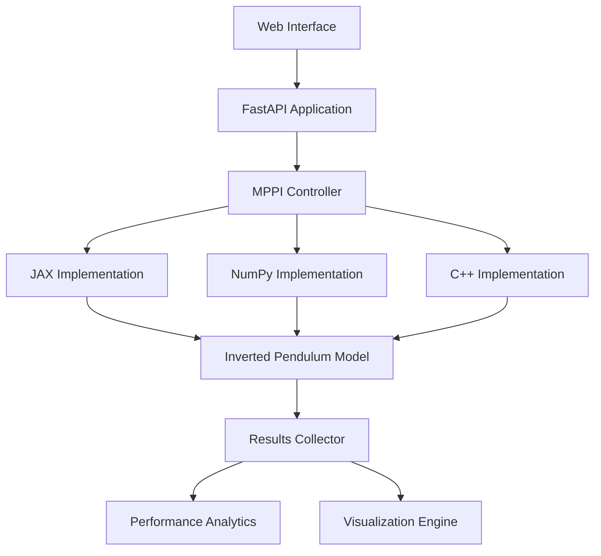

# MPPI_advanced_python_project
Реализация алгоритма стохастического оптимального управления Model Predictive Path Integral с использованием JAX, Python + Pybind11 + C++ и Python + Numpy. Алгоритм находит решение для задачи балансировки перевернутого маятника.

## Содержание
1. [Обзор проекта](#обзор-проекта)
2. [План работы](#план-работы)
3. [Архитектура системы](#архитектура-системы)
4. [Структура проекта](#структура-проекта)
5. [Тестирование](#тестирование)
6. [Развертывание](#развертывание)
7. [Реализации алгоритма](#реализации-алгоритма)

## Обзор проекта

### Основные задачи
1. Реализация алгоритма MPPI на трех технологических стеках:
* JAX
* Python + Pybind11 + C++
* Python + Numpy
2. Создание единого интерфейса для всех реализаций
3. Валидация корректности работы алгоритмов
4. Сравнение производительности реализаций
5. Докеризация и развертывание в облаке

### Что видит пользователь

- **Веб-интерфейс** с визуализацией работы маятника в реальном времени
- **Возможность настройки** параметров системы и алгоритма
- **Графики сравнения** производительности разных реализаций алгоритма
- **Статистику работы** и метрики


## Архитектура системы



### Описание

1. **Пользователь** через Web Interface настраивает эксперимент
2. **FastAPI** валидирует запрос и передаёт в MPPI Controller
3. **MPPI Controller** выбирает нужную реализацию и запускает симуляцию
4. **Выбранная реализация** взаимодействует с общей моделью маятника
5. **Results Collector** агрегирует данные со всех симуляций
6. **Performance Analytics** анализирует метрики производительности
7. **Visualization Engine** создаёт графики и отчёты
8. **Результаты** возвращаются через FastAPI в Web Interface

### Компоненты системы

**Core Components:**
- `MPPIController` - абстрактный базовый класс
- `DynamicsModel` - модель динамики маятника
- `CostFunction` - функция стоимости
- `NoiseGenerator` - генератор шумов

**Реализации:**
- `MPPIJAX` - JAX-версия с JIT-компиляцией
- `MPPINumpy` - Pure Python/NumPy версия
- `MPPICPP` - C++ с PyBind11 биндингами

## Структура проекта

```
project/
├── src/
│   ├── core/                    # Абстрактные классы и интерфейсы
│   │   ├── base_controller.py
│   │   ├── dynamics.py
│   │   └── cost_function.py
│   ├── implementations/
│   │   ├── jax/                # JAX реализация
│   │   ├── numpy/              # NumPy реализация
│   │   └── cpp/                # C++ реализация
│   └── models/
│       └── inverted_pendulum.py # Физическая модель системы
├── tests/                      # Тесты всех компонентов
├── benchmarks/                 # Бенчмарки производительности
├── docker/                     # Docker конфигурации
├── docs/                       # Документация
└── examples/                   # Примеры использования
```

## План работы


### Шаг 1: Подготовка инфраструктуры (4 дня)
- [ ] Настройка структуры проекта и CI/CD - 1 день
- [ ] Создание базовых интерфейсов и абстрактных классов - 1 день
- [ ] Настройка тестового окружения - 1 день
- [ ] Докеризация базовых компонентов - 1 день

### Шаг 2: Реализация алгоритмов (3 дня)
- [ ] NumPy реализация - 1 день
- [ ] JAX реализация с оптимизацией - 1 день
- [ ] C++ реализация с PyBind11 - 1 день

### Шаг 3: Интеграция и тестирование (3 дня)
- [ ] Создание единого API - 1 день
- [ ] Написание тестов - 1 день
- [ ] Бенчмаркинг производительности - 1 день

### Шаг 4: Визуализация и развертывание (2 дня)
- [ ] Веб-интерфейс с визуализацией - 1 день
- [ ] Развертывание в облаке - 1 день

**Общее время: примерно 12 дней**

## Тестирование

### Стратегия тестирования
- **Unit tests** для каждого компонента
- **Integration tests** для проверки взаимодействия реализаций
- **Performance tests** для сравнения скорости работы
- **Regression tests** для проверки корректности алгоритма

### Метрики качества
- Coverage ≥ 65%
- Соответствие результатов всех реализаций
- Производительность относительно референсной реализации

---

*Проект разработан с использованием принципов SOLID и паттернов проектирования для обеспечения расширяемости и поддерживаемости кода.*
