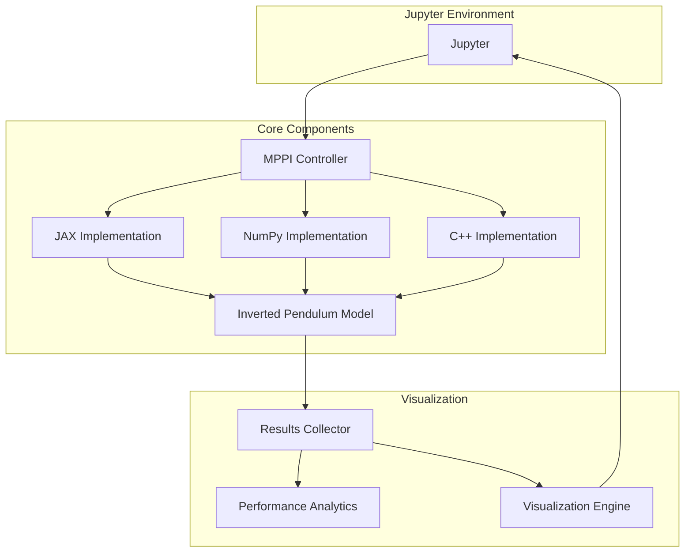

# Алгоритм MPPI для задачи балансировки перевёрнутого маятника
Реализация алгоритма стохастического оптимального управления Model Predictive Path Integral с использованием JAX, Python + Pybind11 + C++ и Python + Numpy. Алгоритм находит решение для задачи балансировки перевернутого маятника.

## Содержание
1. [Обзор проекта](#обзор-проекта)
2. [Описание алгоритма](#реализации-алгоритма)
3. [План работы](#план-работы)
4. [Архитектура системы](#архитектура-системы)
5. [Структура проекта](#структура-проекта)
6. [Интерфейс](#интерфейс)
7. [Тестирование](#тестирование)
8. [Докеризация](#докеризация)

## Обзор проекта

### Основные задачи
1. Реализация алгоритма MPPI на трех технологических стеках:
* JAX
* Python + Pybind11 + C++
* Python + Numpy
2. Создание единого интерфейса для всех реализаций через Jupyter Notebook
3. Валидация корректности работы алгоритмов
4. Сравнение производительности реализаций
5. Докеризация и развертывание с Jupyter

### Что видит пользователь

- **Интерактивный Jupyter Notebook** с визуализацией работы маятника в реальном времени
- **Интерактивные элементы управления** для настройки параметров системы и алгоритма
- **Графики сравнения** производительности разных реализаций алгоритма
- **Статистику работы** и метрики
- **Анимацию движения** маятника и тележки

## Описание алгоритма
### Что такое задача перевёрнутого маятника
Есть тележка, которая может двигаться влево-вправо, и закреплённый на ней маятник, удерживаемый в вертикальном положении вверх. Т.к. данная система неустойчива и маятник будет падать при малейшем отклонении, то задача управления — балансировать маятник вертикально, двигая тележку.


Уравнения движения, которыми осписывается модель:

$$
(M + m)\ddot{x} - m l\ddot{\theta}\cos\theta + m l\dot{\theta}^{2}\sin\theta = F,
$$

$$
l\ddot{\theta} - g \sin\theta = \ddot{x}\cos\theta.
$$

Или если решить систему относительно $\ddot{x}$ и $\ddot{\theta}$, то получится:

$$
\ddot{x} =
\frac{F + m\sin\theta (l\dot{\theta}^2 + g\cos\theta)}
{M + m\sin^2\theta}
$$

$$
\ddot{\theta} =
\frac{-F\cos\theta - m l \dot{\theta}^2 \cos\theta \sin\theta - (M+m)g \sin\theta}
{l (M + m\sin^2\theta)}.
$$


### Описание переменных

| Обозначение                   | Значение                                                      |
| ----------------------------- | ------------------------------------------------------------- |
| $M$                           | масса тележки                                                 |
| $m$                           | масса маятника                                                |
| $l$                           | длина маятника (расстояние от точки крепления до центра масс) |
| $x$                           | горизонтальная координата тележки                             |
| $\theta$                      | угол отклонения маятника от вертикали                         |
| $F$                           | прикладываемая к тележке горизонтальная сила                  |
| $g$                           | ускорение свободного падения                                  |
| $\dot{x}, \ddot{x}$           | скорость и ускорение тележки                                  |
| $\dot{\theta}, \ddot{\theta}$ | угловая скорость и угловое ускорение маятника                 |


### В чём суть алгоритм MPPI и как он может помочь в этой задаче
Алгоритм MPPI используется для управления нелинейными системами с возмущениями и неопределённостью (т.е. системами, на работу которых воздействуют внешние или внутренние факторы, не учитываемые напрямую в модели: например, для маятника это может быть трение, порыв ветра или погрешность датчиков). Такие системы описываются сложными дифференциальными уравнениями, и найти точное оптимальное управление для них очень трудно. Алгоритм MPPI предлагает приближённое, но достаточно эффективное решение.

Чтобы спрогнозировать состояние объекта в следующий момент времени (куда и с какой силой двигать тележку), алгоритм MPPI получает на вход данные о текущем состоянии системы (положение и скорость тележки, угол и скорость маятника). Затем на $T$ шагов вперёд генерирует $K$ различных случайных последовательностей сил, применяемых к тележке. Эти последовательности получаются добавлением случайных «возмущений» $\epsilon_i$ к текущей наилучшей траектории управления

Для каждой такой последовательности алгоритм с помощью модели динамики системы (тех самых уравнений) просчитывает, какая траектория состояния получится. Затем для каждой траектории считается стоимость $s_i$ по заранее заданной функции cost_function. Эта функция «штрафует» за нежелательные состояния (например, большое отклонение маятника от вертикали) и за большие затраты усилий.

$$w_i = \exp\left( -\frac{1}{\lambda} (s_i - \min_j s_j) \right)$$

где $\lambda$ — это выбранный нами параметр. Он регулирует, насколько сильно мы предпочитаем траектории с низкой стоимостью. Вычитание минимальной стоимости ($\min_j s_j$) необходимо для численной устойчивости вычислений.

Далее все сгенерированные последовательности сил усредняются с учётом их весов, и новая оптимальная траектория управления (последовательность сил на $T$ шагов вперёд) вычисляется так:

$$u_{new} = u_{current} + \frac{\sum_{i=1}^{K} w_i \cdot \epsilon_i}{\sum_{i=1}^{K} w_i}$$

Затем на реальную систему (тележку) подаётся только первая сила из обновлённой последовательности $u_{new}$. После этого система измеряет своё новое состояние, текущая траектория сдвигается, и весь цикл повторяется.

Преимущество MPPI в том, что просчёт тысяч случайных траекторий можно легко распараллелить (например, на GPU). Поэтому алгоритм успевает найти хорошее решение очень быстро, что критически важно для таких задач, как балансировка маятника, где тележка должна реагировать мгновенно, чтобы маятник не упал.

## План работы


### Шаг 1: Подготовка инфраструктуры (3 дня)
- [X] Настройка структуры проекта - 1 день
- [X] Создание базовых интерфейсов и абстрактных классов - 1 день
- [X] Написание модели маятника - 1 день

### Шаг 2: Реализация алгоритмов (3 дня)
- [X] NumPy реализация - 1 день
- [X] JAX реализация - 1 день
- [X] C++ реализация с PyBind11 - 1 день

### Шаг 3: Визулизация результатов (2 дня)
- [X] Написание классов и функций для визуализации - 1 день
- [X] Создание Jupyter Notebook с интерактивными элементами - 1 день


### Шаг 4: Тестирование и развертывание (2 дня)
- [X] Написание тестов и исправление найденных багов - 1 день
- [X] Докеризация - 1 день

**Общее время: примерно 10 дней**

## Архитектура системы



### Описание

1. **Пользователь** взаимодействует с Jupyter Notebook, используя интерактивные виджеты для настройки эксперимента
2. **MPPI Controller** получает параметры и выбирает нужную реализацию, запускает симуляцию
3. **Выбранная реализация** взаимодействует с общей моделью маятника **Inverted Pendulum Model**
4. **Results Collector** агрегирует данные со всех симуляций
5. **Performance Analytics** анализирует метрики производительности
6. **Visualization Engine** создаёт графики и анимации, которые отображаются в Jupyter Notebook


## Структура проекта

```
project/
├── src/
│ ├── mppi/
│ │ ├── init.py
│ │ ├── base.py # Базовый класс MPPI
│ │ ├── numpy/
│ │ │ ├── init.py
│ │ │ └── mppi_numpy.py
│ │ ├── jax/
│ │ │ ├── init.py
│ │ │ └── mppi_jax.py
│ │ └── cpp/
│ │ ├── init.py
│ │ ├── mppi_cpp.cpp # Код C++
│ │ ├── mppi_cpp.h
│ │ └── bindings.cpp # Обертка Pybind11
│ ├── controller/
│ │ ├── init.py
│ │ ├── mppi_controller.py # Единый интерфейс контроллера
│ │ └── config.py # Классы конфигурации
│ ├── visualization/
│ │ ├── init.py
│ │ ├── animate.py # Анимация маятника
│ │ └── plots.py # Построение графиков
│ └── utils/
│ ├── init.py
│ ├── results_collector.py
│ └── metrics.py
├── notebooks/
│ └── main.ipynb # Основной ноутбук
├── tests/
│ ├── init.py
│ ├── conftest.py # Конфигурация pytest
│ ├── test_base.py 
│ ├── test_numpy_implementation.py
│ ├── test_jax_implementation.py 
│ ├── test_controller.py
│ ├── test_config.py
│ ├── test_utils.py 
│ └── test_integration.py
├── docker/
│ ├── Dockerfile
│ └── docker-compose.yml
├── requirements.txt
└── README.md
```
##  Интерфейс в Jupyter
1. **Краткое описание алгоритма в текстовом формате**
   
2. **Панель управления параметрами**
К параметрам даны краткие пояснения, чтобы пользователю было понятно, за что они отвечают
+ Параметры системы (маятник + тележка)
Слайдеры `FloatSlider` из библиотеки `ipywidgets` 
    - **Масса тележки** (m_cart) - `0.5-5.0 кг`
    - **Масса маятника** (m_pole) - `0.1-2.0 кг`  
    - **Длина маятника** (l) - `0.5-2.0 м`
    - **Начальный угол отклонения** (θ₀) - `-30° до +30°`
    - **Начальная позиция тележки** (x₀) - `-2 до +2 м`
  
+ Параметры алгоритма MPPI
Слайдеры `FloatSlider` из библиотеки `ipywidgets` 
    - **Количество траекторий** (K) - `100-10000`
    - **Горизонт планирования** (T) - `10-100 шагов`
    - **Параметр λ** - `0.1-10.0`
    - **Штрафы за приложение силы к тележке в модели (R)** - `0.01-1.0` 

+ Выбор базовой реализазии (Python/Jax/C++)
С помощью `RadioButtons` из библиотеки `ipywidgets` осуществляется выбор из трёх базовых реализаций 

+ Кнопки управления
Кнопки `Button` из библиотеки `ipywidgets`
    - Запустить (запускает симуляцию)
    - Остановить (останавливает выбранную симуляцию)
    - Сравнить (запускает все симуляции и выводит сравнительные графики работы)

+ Возможность сохранения и повторного запуска результатов симуляции
    Кнопки `Button` из библиотеки `ipywidgets`
    - Сохранить (по умолчанию файл в формате `` сохраняется в той жи директории что и notebook)
    - Загрузить (останавливает выбранную симуляцию)
    

3. Визуализация с помощью matplotlib
   - Анимация маятника (показывает визуально текущее положение тележки и угол наклона маятника)
   - График изменения угла маятника от вертикали
   - График силы, прикладываемой к тележке
   - График положения тележки
   - График значения функции стоимости на каждой итерации MPPI
   - Столбчатая диаграмма сравнения времени работы разных реализаций алгоритма


## Тестирование
Стандартно через pytest.

- Реализованы тесты направленные на проверку работоспособности каждой реализации при различных параметрах, включая экстремальные значения и проверку правильности расчётов модели.

## Докеризация
In development...
(Планируется упаковка в Docker, но нужно разобраться, как это работает)
