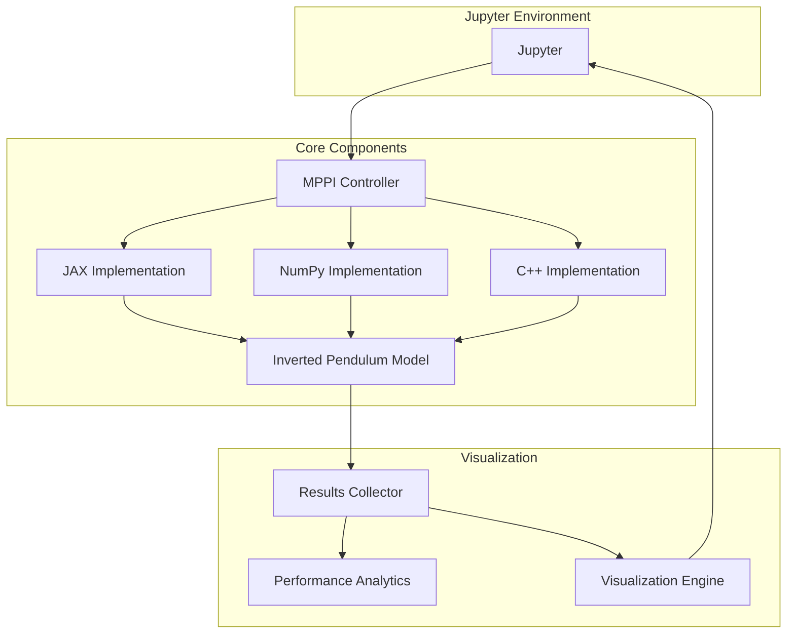

# Алгоритм MPPI для задачи балансировки перевёрнутого маятника
Реализация алгоритма стохастического оптимального управления Model Predictive Path Integral с использованием JAX, Python + Pybind11 + C++ и Python + Numpy. Алгоритм находит решение для задачи балансировки перевернутого маятника.

## Содержание
1. [Обзор проекта](#обзор-проекта)
2. [Описание алгоритма](#реализации-алгоритма)
3. [План работы](#план-работы)
4. [Архитектура системы](#архитектура-системы)
5. [Структура проекта](#структура-проекта)
6. [Визуализация](#визуализация)
7. [Тестирование](#тестирование)
8. [Развертывание](#развертывание)

## Обзор проекта

### Основные задачи
1. Реализация алгоритма MPPI на трех технологических стеках:
* JAX
* Python + Pybind11 + C++
* Python + Numpy
2. Создание единого интерфейса для всех реализаций через Jupyter Notebook
3. Валидация корректности работы алгоритмов
4. Сравнение производительности реализаций
5. Докеризация и развертывание  с Jupyter

### Что видит пользователь

- **Интерактивный Jupyter Notebook** с визуализацией работы маятника в реальном времени
- **Интерактивные элементы управления** для настройки параметров системы и алгоритма
- **Графики сравнения** производительности разных реализаций алгоритма
- **Статистику работы** и метрики
- **Анимацию движения** маятника и тележки

## Описание алгоритма
### Что такое задача перевёрнутого маятника
Есть тележка, которая может двигаться влево-вправо, и закреплённый на ней маятник, удерживаемый в вертикальном положении вверх. Т.к. данная система неустойчива и маятник будет падать при малейшем отклонении, то задача управления — балансировать маятник вертикально, двигая тележку.


### В чём суть алгоритм MPPI и как он может помочь в этой задаче
Алгоритм MPPI используется для управления нелинейными системами с возмущениями и неопределённостью (т.е. системами, на работу которых воздействуют внешние или внутренние факторы, не учитываемые напрямую в модели: например, для маятника это может быть трение, порыв ветра или погрешность датчиков). Такие системы описываются сложными дифференциальными уравнениями, и найти точное оптимальное управление для них очень трудно. Алгоритм MPPI предлагает приближённое, но достаточно эффективное решение.

Чтобы спрогнозировать состояние объекта в следующий момент времени (куда и с какой силой двигать тележку), алгоритм MPPI получает на вход данные о текущем состоянии системы (положение и скорость тележки, угол и скорость маятника). Затем на $T$ шагов вперёд генерирует $K$ различных случайных последовательностей сил, применяемых к тележке. Эти последовательности получаются добавлением случайных «возмущений» $\epsilon_i$ к текущей наилучшей траектории управления

Для каждой такой последовательности алгоритм с помощью модели динамики системы (тех самых уравнений) просчитывает, какая траектория состояния получится. Затем для каждой траектории считается стоимость $s_i$ по заранее заданной функции cost_function. Эта функция «штрафует» за нежелательные состояния (например, большое отклонение маятника от вертикали) и за большие затраты усилий.

$$w_i = \exp\left( -\frac{1}{\lambda} (s_i - \min_j s_j) \right)$$

где $\lambda$ — это выбранный нами параметр. Он регулирует, насколько сильно мы предпочитаем траектории с низкой стоимостью. Вычитание минимальной стоимости ($\min_j s_j$) необходимо для численной устойчивости вычислений.

Далее все сгенерированные последовательности сил усредняются с учётом их весов, и новая оптимальная траектория управления (последовательность сил на $T$ шагов вперёд) вычисляется так:

$$u_{new} = u_{current} + \frac{\sum_{i=1}^{K} w_i \cdot \epsilon_i}{\sum_{i=1}^{K} w_i}$$

Затем на реальную систему (тележку) подаётся только первая сила из обновлённой последовательности $u_{new}$. После этого система измеряет своё новое состояние, текущая траектория сдвигается, и весь цикл повторяется.

Преимущество MPPI в том, что просчёт тысяч случайных траекторий можно легко распараллелить (например, на GPU). Поэтому алгоритм успевает найти хорошее решение очень быстро, что критически важно для таких задач, как балансировка маятника, где тележка должна реагировать мгновенно, чтобы маятник не упал.

## План работы


### Шаг 1: Подготовка инфраструктуры (4 дня)
- [ ] Настройка структуры проекта и CI/CD - 1 день
- [ ] Создание базовых интерфейсов и абстрактных классов () - 1 день
- [ ] Настройка тестового окружения - 1 день
- [ ] Докеризация базовых компонентов - 1 день

### Шаг 2: Реализация алгоритмов (3 дня)
- [ ] NumPy реализация - 1 день
- [ ] JAX реализация с оптимизацией - 1 день
- [ ] C++ реализация с PyBind11 - 1 день

### Шаг 3: Интеграция и тестирование (3 дня)
- [ ] Создание единого API - 1 день
- [ ] Написание тестов - 1 день
- [ ] Бенчмаркинг производительности - 1 день

### Шаг 4: Визуализация и развертывание (3 дня)
- [ ] Создание Jupyter Notebook с интерактивными элементами - 2 день
- [ ] Развертывание в облаке - 1 день

**Общее время: примерно 13 дней**

## Архитектура системы



### Описание

1. **Пользователь** взаимодействует с Jupyter Notebook, используя интерактивные виджеты для настройки эксперимента
2. **MPPI Controller** получает параметры и выбирает нужную реализацию, запускает симуляцию
3. **Выбранная реализация** взаимодействует с общей моделью маятника **Inverted Pendulum Model**
4. **Results Collector** агрегирует данные со всех симуляций
5. **Performance Analytics** анализирует метрики производительности
6. **Visualization Engine** создаёт графики и анимации, которые отображаются в Jupyter Notebook


## Структура проекта

```
project/
├── src/
│   ├── core/                    # Абстрактные классы и интерфейсы
│   │   ├── base_controller.py
│   │   ├── dynamics.py
│   │   └── cost_function.py
│   ├── implementations/
│   │   ├── jax/                # JAX реализация
│   │   ├── numpy/              # NumPy реализация
│   │   └── cpp/                # C++ реализация
│   └── models/
│       └── inverted_pendulum.py # Физическая модель системы
├── tests/                      # Тесты всех компонентов
├── benchmarks/                 # Бенчмарки производительности
├── docker/                     # Docker конфигурации
├── docs/                       # Документация
└── examples/                   # Примеры использования
```
##  Интерфейс в Jupiter
1. **Краткое описание алгоритма в текстовом формате**
   
2. **Панель управления параметрами**
К каждому параметру будут даны краткие пояснения, чтобы пользователю было понятно, за что они отвечают
#### Параметры системы (маятник + тележка)
Слайдеры `FloatSlider` из библиотеки `ipywidgets` 
- **Масса тележки** (m_cart) - `0.5-5.0 кг`
- **Масса маятника** (m_pole) - `0.1-2.0 кг`  
- **Длина маятника** (l) - `0.5-2.0 м`
- **Начальный угол отклонения** (θ₀) - `-30° до +30°`
- **Начальная позиция тележки** (x₀) - `-2 до +2 м`
- 
#### Параметры алгоритма MPPI
Слайдеры `FloatSlider` из библиотеки `ipywidgets` 
- **Количество траекторий** (K) - `100-10000`
- **Горизонт планирования** (T) - `10-100 шагов`
- **Параметр λ** - `0.1-10.0`

#### Выбор базовой реализазии (Python/Jax/C++)
С помощью `RadioButtons` из библиотеки `ipywidgets` осуществляется выбор из трёх базовых реализаций 

#### Кнопки управления
Кнопки `Button` из библиотеки `ipywidgets`
- Run Simulation (запускает симуляцию)
- Stop (останавливает выбранную симуляцию)
- Compare All (запускает все симуляции и выводит сравнительные графики работы)

3. Анимация маятника с помощью matplotlib.subplot2grid
4. Графики с помощью matplotlib

## Визуализация
**Статические графики и анимации с помощью matplotlib**

1. `plot_single_simulation()` - детальная визуализация одной симуляции
2. `plot_comparison()` - сравнение всех реализаций
3. `create_animation()` - анимация движения маятника
4. `plot_performance_metrics()` - метрики производительности

## Тестирование
Реализация 4 различных групп тестов
- **Модульные тесты** - проверка отдельных компонентов
- **Интеграционные тесты** - взаимодействие между компонентами и API
- **Функциональные тесты** - проверка корректности работы алгоритма на задаче маятника
- **Тесты производительности** - оценка скорости и памяти для всех реализаций

## Развёртывание
In development...

(Планируется упаковка в Docker, но нужно разобраться, как это работает)
